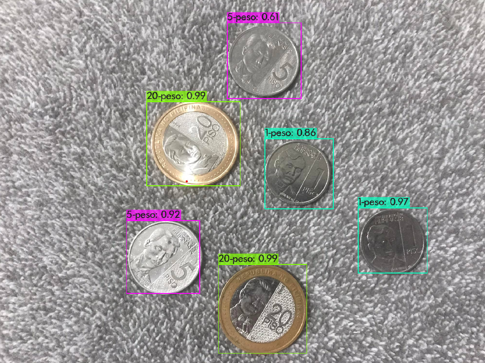
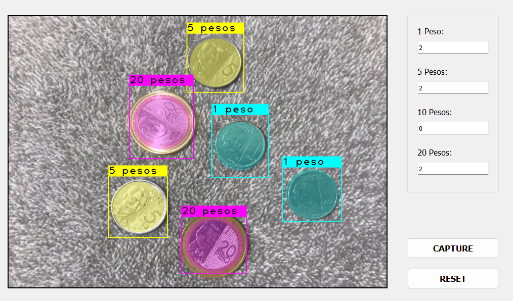

# Philippine Coins Object Detection

Project from Mapua to detect and count the number of the new Philippine coins using computer vision ported in Raspberry Pi.

This repository contains only the files needed for darknet YOLO tiny v4 training and the final program with the PyQt5 interface. It doesn't contain the full setup of the darknet.

## Languages and Tools Used

- Python
- Darknet YOLO tiny v4
- PyQt5
- Raspberry Pi 4




## Setup on Windows and Raspberry Pi

- Python 3.8 above and pip must be installed in your computer.
- Clone this repository.
- Install virtualenv package.

```
pip install virtualenv
```

- Create a virtual environment. Lets name it `my-venv`.

```
virtualenv my-venv
```

- Activate virtual environment.

For Windows:

```
my-venv\Scripts\activate
```

For Raspberry Pi:

```
source my-venv/bin/activate
```

You also need to install Qt5 using apt package manager in Raspberry Pi.

```
sudo apt install qtbase5-dev qtchooser qt5-qmake qtbase5-dev-tools
```

- Install the required Python packages.

For Windows:

```
pip install -r requirements_windows.txt
```

For Raspberry Pi:

```
pip install -r requirements_raspberry_pi.txt
```

- Change directory to `app` folder and run `main.py`.

For Windows

```
python main.py
```

For Linux/Raspberry Pi:

```
python3 main.py
```

The program will use the default webcam on your computer or Raspberry Pi that it is connected to. It is also compatible with Pi Camera as well.
